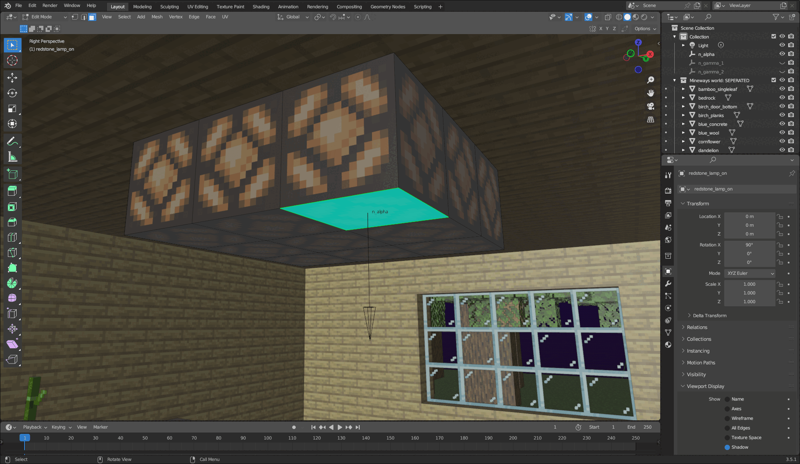
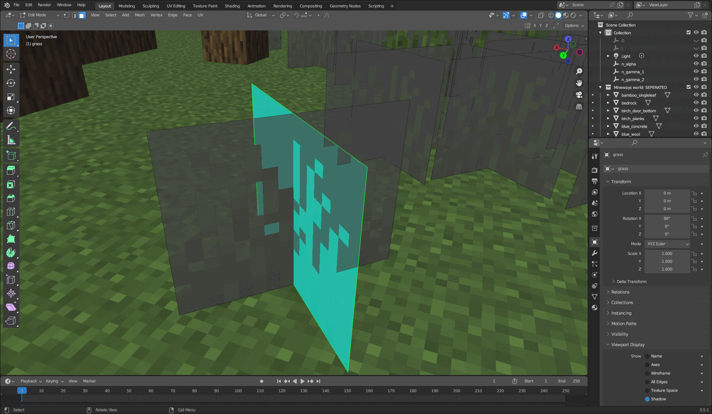

This is my paper on an alternative block detection algorithm for MCprep's meshswap. It was published on 25/6/2023 (the 25th of June 2023) on this GitHub issue in the MCprep repo: https://github.com/TheDuckCow/MCprep/issues/434 and revised on 30/6/2023 to include some fixes in typos and definitions of algorithm steps.

This paper introduced a new method of detecting blocks for meshswap that would not only be faster (in theory), but also be easier to implement and be more friendly with geometry nodes.

Here are some gifs on how it would select the faces of a block:

